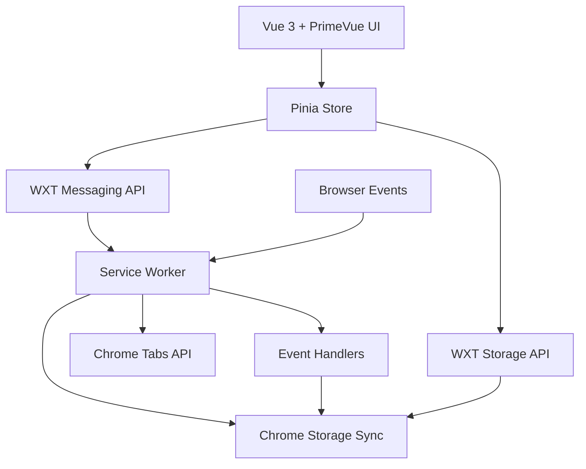

# Design Document

## Overview

PackTabs is a Chrome Manifest V3 extension that provides efficient tab group management through a Vue.js-based interface. Built with the WXT Framework for modern extension development, the system follows a clean architecture pattern with clear separation between the Chrome extension layer (service worker), data persistence layer (Chrome Storage Sync API), and presentation layer (Vue 3 + PrimeVue components). The design emphasizes simplicity, performance, and cross-device synchronization.

## Technology Stack

- **[WXT Framework](https://wxt.dev/)**: Modern web extension development framework providing type-safe APIs, hot module reloading, and streamlined build process
- **[Vue 3](https://vuejs.org/)**: Progressive JavaScript framework with Composition API for reactive UI components
- **[PrimeVue](https://primevue.org/)**: Comprehensive Vue UI component library with Material Design theme for consistent, professional interface
- **[TypeScript](https://www.typescriptlang.org/)**: Type-safe development ensuring compile-time error detection and better IDE support
- **[Manifest V3](https://developer.chrome.com/docs/extensions/develop/migrate/what-is-mv3)**: Latest Chrome extension manifest version with service workers and enhanced security
- **[Pinia](https://pinia.vuejs.org/)**: Official Vue state management library for sharing state across components and pages
- **[Bun](https://bun.sh/)**: Fast JavaScript runtime and package manager for improved development experience
- **[Vitest](https://vitest.dev/)**: Vite-powered unit testing framework compatible with WXT
- **[fast-check](https://fast-check.dev/)**: Property-based testing library for TypeScript

## Project Structure

WXT follows a convention-based project structure:

```
packtabs/
├── entrypoints/
│   ├── background.ts              # Service worker (Manifest V3)
│   └── dashboard/                 # Management page
│       ├── index.html
│       ├── main.ts
│       ├── App.vue
│       └── style.css
├── components/
│   ├── TabGroupCard.vue           # Tab group display component
│   ├── TabGroupList.vue           # List of tab groups
│   └── TabItem.vue                # Individual tab display
├── stores/
│   └── useTabStore.ts             # Pinia store for tab groups
├── utils/
│   ├── storage.ts                 # WXT storage API wrapper
│   ├── tabManager.ts              # Tab operations utility
│   └── init-app.ts                # Vue app initialization
├── types/
│   ├── TabGroup.ts                # TypeScript type definitions
│   └── Storage.ts                 # Storage schema types
├── tests/
│   ├── unit/                      # Unit tests
│   └── property/                  # Property-based tests
├── public/
│   └── icon/                      # Extension icons
├── wxt.config.ts                  # WXT configuration
├── tsconfig.json                  # TypeScript configuration
└── package.json                   # Dependencies and scripts
```

**Design Rationale**: WXT's convention-based structure eliminates configuration overhead. The `entrypoints/` directory automatically generates manifest entries, and the framework handles bundling, hot reloading, and type generation.

## WXT Configuration

### Extension Configuration

```typescript
// wxt.config.ts
import { defineConfig } from 'wxt';

export default defineConfig({
  modules: ['@wxt-dev/module-vue'],
  manifest: {
    name: 'PackTabs',
    description: 'Efficient tab group management for Chrome',
    permissions: ['tabs', 'storage'],
    action: {
      default_title: 'PackTabs Manager'
    }
  },
  runner: {
    chromiumArgs: ['--auto-open-devtools-for-tabs']
  }
});
```

### Vue + PrimeVue Setup

```typescript
// utils/init-app.ts
import { createApp } from 'vue';
import { createPinia } from 'pinia';
import PrimeVue from 'primevue/config';
import Material from '@primevue/themes/material';
import ToastService from 'primevue/toastservice';
import ConfirmationService from 'primevue/confirmationservice';

export function initApp(rootComponent: Component) {
  const app = createApp(rootComponent);
  const pinia = createPinia();
  
  app.use(pinia);
  app.use(PrimeVue, {
    theme: {
      preset: Material,
      options: {
        darkModeSelector: '.dark-mode'
      }
    }
  });
  app.use(ToastService);
  app.use(ConfirmationService);
  
  return app;
}
```

**Design Rationale**: WXT's Vue module provides automatic setup for Vue 3 with HMR support. PrimeVue's Material theme ensures consistent design language. The centralized app initialization function ensures consistent setup across all extension pages.

## Architecture

### High-Level Architecture



**Design Rationale**: WXT Framework provides type-safe wrappers around Chrome extension APIs, eliminating boilerplate and improving developer experience. The framework's built-in storage and messaging APIs simplify communication between UI and background scripts.

### Component Architecture

The extension follows a layered architecture optimized for WXT:

1. **Presentation Layer**: Vue 3 components with PrimeVue UI library and Pinia state management
2. **State Management Layer**: Pinia stores with WXT storage integration for persistence
3. **Service Worker Layer**: WXT-managed background script for event handling and business logic
4. **Storage Layer**: WXT storage API wrapping Chrome Storage Sync for type-safe data operations

**Design Rationale**: This architecture leverages WXT's conventions while maintaining clean separation of concerns. PrimeVue provides production-ready components, reducing custom UI development time.

## Components and Interfaces

### Core Components

#### 1. Service Worker (Background Script)
- **Location**: `entrypoints/background.ts` (WXT convention)
- **Purpose**: Handle browser events, manage tab operations, coordinate data persistence
- **Key Responsibilities**:
  - Listen for browser close events to create History_Tab_Groups
  - Handle tab capture and restoration operations via Chrome Tabs API
  - Manage Chrome Storage Sync operations through WXT storage API
  - Coordinate between UI and Chrome APIs via WXT messaging
- **Design Rationale**: WXT automatically configures the service worker with proper Manifest V3 settings and provides type-safe API wrappers

#### 2. Management Page (Vue 3 Application)
- **Location**: `entrypoints/dashboard/` (WXT convention for full-page extensions)
- **Purpose**: Main user interface for tab group management
- **Key Components**:
  - `App.vue`: Root component with PrimeVue Sidebar navigation
  - `TabGroupCard.vue`: Individual tab group display using PrimeVue Card component
  - `TabGroupList.vue`: List container using PrimeVue DataView or custom layout
  - `TabItem.vue`: Individual tab display with PrimeVue Button and Avatar components
- **Design Rationale**: PrimeVue provides consistent Material Design styling and accessibility features out-of-the-box, reducing custom CSS and ensuring professional appearance

#### 3. Tab Store (Pinia)
- **Location**: `stores/useTabStore.ts`
- **Purpose**: Centralized state management for tab group data with WXT storage integration
- **Key Responsibilities**:
  - Maintain reactive tab groups state
  - Handle CRUD operations for tab groups
  - Sync with Chrome Storage via WXT storage API
  - Provide computed properties for filtered/sorted groups
  - Expose actions for UI components
- **Design Rationale**: Pinia's composition API style integrates seamlessly with Vue 3 and WXT's TypeScript support ensures type safety across the application

#### 4. Storage Service
- **Location**: `utils/storage.ts`
- **Purpose**: Abstraction layer over WXT storage API for tab group operations
- **Key Responsibilities**:
  - Serialize/deserialize tab group data with TypeScript type validation
  - Handle storage conflicts and sync issues
  - Provide consistent API for data operations
  - Implement retry logic for failed operations
- **Design Rationale**: WXT's storage API provides type-safe wrappers around Chrome Storage Sync, eliminating manual type casting and improving reliability

### Interface Definitions

#### Tab Group Data Model
```typescript
// types/TabGroup.ts
export interface TabGroup {
  id: string;
  name: string | null; // null for History_Tab_Groups
  createdAt: Date;
  tabs: TabItem[];
  isHistory: boolean;
}

export interface TabItem {
  id: string;
  url: string;
  title: string;
  faviconUrl?: string;
}
```

#### Storage Service Interface
```typescript
// utils/storage.ts
import { storage } from 'wxt/storage';

export interface StorageService {
  saveTabGroup(group: TabGroup): Promise<void>;
  getTabGroups(): Promise<TabGroup[]>;
  updateTabGroup(id: string, updates: Partial<TabGroup>): Promise<void>;
  deleteTabGroup(id: string): Promise<void>;
  deleteTabFromGroup(groupId: string, tabId: string): Promise<void>;
}

// WXT storage items with type safety
export const tabGroupsStorage = storage.defineItem<Record<string, TabGroup>>(
  'sync:tabGroups',
  { defaultValue: {} }
);
```

#### Tab Management Interface
```typescript
// utils/tabManager.ts
export interface TabManager {
  captureCurrentWindow(): Promise<TabItem[]>;
  openTabs(tabs: TabItem[]): Promise<void>;
  openSingleTab(tab: TabItem): Promise<void>;
  closeCurrentTabs(): Promise<void>;
}
```

#### Pinia Store Interface
```typescript
// stores/useTabStore.ts
import { defineStore } from 'pinia';

export const useTabStore = defineStore('tabs', () => {
  // State
  const tabGroups = ref<TabGroup[]>([]);
  const selectedGroupId = ref<string | null>(null);
  
  // Getters
  const historyGroups = computed(() => 
    tabGroups.value.filter(g => g.isHistory)
  );
  const namedGroups = computed(() => 
    tabGroups.value.filter(g => !g.isHistory)
  );
  const selectedGroup = computed(() => 
    tabGroups.value.find(g => g.id === selectedGroupId.value)
  );
  
  // Actions
  async function loadGroups(): Promise<void>;
  async function saveGroup(group: TabGroup): Promise<void>;
  async function updateGroup(id: string, updates: Partial<TabGroup>): Promise<void>;
  async function deleteGroup(id: string): Promise<void>;
  async function deleteTab(groupId: string, tabId: string): Promise<void>;
  async function convertToNamed(groupId: string, name: string): Promise<void>;
  
  return {
    tabGroups,
    selectedGroupId,
    historyGroups,
    namedGroups,
    selectedGroup,
    loadGroups,
    saveGroup,
    updateGroup,
    deleteGroup,
    deleteTab,
    convertToNamed
  };
});
```

**Design Rationale**: WXT's storage API provides type-safe storage definitions that eliminate runtime errors. Pinia's composition API style with TypeScript ensures full type inference across the application.

## Data Models

### Storage Schema

The extension uses WXT's type-safe storage API wrapping Chrome Storage Sync:

```typescript
// types/Storage.ts
export interface StorageSchema {
  // WXT storage key: 'sync:tabGroups'
  tabGroups: {
    [groupId: string]: {
      id: string;
      name: string | null;
      createdAt: string; // ISO date string for serialization
      tabs: {
        id: string;
        url: string;
        title: string;
        faviconUrl?: string;
      }[];
      isHistory: boolean;
    }
  };
  
  // WXT storage key: 'sync:settings'
  settings: {
    autoCloseAfterSave: boolean;
    maxHistoryGroups: number;
  };
}

// WXT storage definitions
import { storage } from 'wxt/storage';

export const tabGroupsStorage = storage.defineItem<StorageSchema['tabGroups']>(
  'sync:tabGroups',
  { defaultValue: {} }
);

export const settingsStorage = storage.defineItem<StorageSchema['settings']>(
  'sync:settings',
  { 
    defaultValue: {
      autoCloseAfterSave: true,
      maxHistoryGroups: 10
    }
  }
);
```

**Design Rationale**: WXT's `storage.defineItem` provides compile-time type checking and runtime validation, preventing storage-related bugs. The `sync:` prefix automatically uses Chrome Storage Sync for cross-device synchronization.

### Data Flow

1. **Tab Capture Flow**:
   - User triggers save action in Vue component
   - Component calls Pinia store action
   - Store invokes background script via WXT messaging
   - Background script captures tabs using Chrome Tabs API
   - Background script persists via WXT storage API
   - Storage change triggers Pinia store update
   - Vue components reactively update UI
   
2. **Tab Restoration Flow**:
   - User clicks "Open All" in PrimeVue Card component
   - Component calls Pinia store action
   - Store invokes background script via WXT messaging
   - Background script opens tabs using Chrome Tabs API
   - Optional: close original tabs based on settings
   
3. **Group Management Flow**:
   - User modifies group in PrimeVue component (inline edit, delete)
   - Component calls Pinia store action
   - Store updates local state and persists via WXT storage API
   - Storage change propagates to all open extension pages
   - Vue components reactively reflect updates

**Design Rationale**: WXT's messaging API simplifies communication between UI and background script with type-safe message definitions. Pinia's reactivity ensures UI stays synchronized with storage changes.

## UI Component Design

### PrimeVue Component Usage

The extension leverages PrimeVue components with Material Design theme for consistent, professional UI:

#### Management Page Layout
```vue
<!-- entrypoints/dashboard/App.vue -->
<template>
  <div class="layout-wrapper">
    <Sidebar v-model:visible="sidebarVisible" :showCloseIcon="false">
      <Menu :model="menuItems" @item-click="onMenuItemClick" />
    </Sidebar>
    
    <div class="content-area">
      <Toolbar>
        <template #start>
          <Button icon="pi pi-bars" @click="sidebarVisible = true" />
          <span class="ml-2 text-xl font-semibold">PackTabs</span>
        </template>
        <template #end>
          <Button label="Save Current Tabs" icon="pi pi-save" @click="saveCurrentTabs" />
        </template>
      </Toolbar>
      
      <div class="p-4">
        <TabGroupList :groups="displayedGroups" />
      </div>
    </div>
  </div>
</template>
```

**Design Rationale**: PrimeVue's Sidebar, Menu, Toolbar, and Button components provide responsive, accessible navigation with minimal custom code.

#### Tab Group Card Component
```vue
<!-- components/TabGroupCard.vue -->
<template>
  <Card class="mb-3">
    <template #header>
      <div class="flex justify-content-between align-items-center p-3">
        <div class="flex-grow-1">
          <InlineEdit v-model="groupName" @update="onNameUpdate" />
          <div class="text-sm text-color-secondary">
            <i class="pi pi-calendar mr-1"></i>
            {{ formatDate(group.createdAt) }}
          </div>
        </div>
        <Chip :label="`${group.tabs.length} tabs`" />
      </div>
    </template>
    
    <template #content>
      <DataView :value="group.tabs" layout="list">
        <template #list="{ data }">
          <div class="flex align-items-center p-2 hover:surface-hover cursor-pointer">
            <Avatar :image="getFaviconUrl(data.url)" shape="circle" size="small" />
            <span class="ml-2 flex-grow-1" @click="openTab(data)">{{ data.title }}</span>
            <Button 
              icon="pi pi-times" 
              severity="danger" 
              text 
              rounded 
              @click="deleteTab(data.id)"
            />
          </div>
        </template>
      </DataView>
    </template>
    
    <template #footer>
      <div class="flex gap-2">
        <Button 
          label="Open All" 
          icon="pi pi-external-link" 
          @click="openAllTabs"
          severity="success"
        />
        <Button 
          v-if="group.isHistory"
          label="Save" 
          icon="pi pi-save" 
          @click="showSaveDialog"
        />
        <Button 
          v-else
          label="Update" 
          icon="pi pi-refresh" 
          @click="updateGroup"
        />
        <Button 
          label="Delete" 
          icon="pi pi-trash" 
          severity="danger" 
          @click="confirmDelete"
        />
      </div>
    </template>
  </Card>
</template>
```

**Design Rationale**: 
- PrimeVue Card provides structured layout with header/content/footer slots
- DataView handles list rendering with built-in styling
- Avatar component displays favicons with fallback support
- Button components with icons and severity levels provide clear visual hierarchy
- Chip component displays tab count as a badge

#### Dialog Components
```vue
<!-- Using PrimeVue Dialog for confirmations and inputs -->
<Dialog v-model:visible="showNameDialog" header="Name Tab Group" modal>
  <div class="flex flex-column gap-2">
    <label for="groupName">Group Name</label>
    <InputText id="groupName" v-model="newGroupName" autofocus />
  </div>
  <template #footer>
    <Button label="Cancel" severity="secondary" @click="showNameDialog = false" />
    <Button label="Save" @click="saveWithName" />
  </template>
</Dialog>

<ConfirmDialog />
```

**Design Rationale**: PrimeVue's Dialog and ConfirmDialog components provide accessible, modal interactions with keyboard navigation and focus management built-in.

## Correctness Properties

*A property is a characteristic or behavior that should hold true across all valid executions of a system-essentially, a formal statement about what the system should do. Properties serve as the bridge between human-readable specifications and machine-verifiable correctness guarantees.*

### Property 1: Tab Capture Completeness
*For any* browser window with open tabs, when the save action is triggered, all tabs from that window should be captured with their URL, title, and favicon reference preserved.
**Validates: Requirements 1.1, 1.2**

### Property 2: Tab Group Data Persistence
*For any* tab group operation (save, update, delete, individual tab modification), the changes should be persisted using Chrome Storage Sync and be retrievable in subsequent operations.
**Validates: Requirements 1.5, 2.4, 7.1, 8.4**

### Property 3: Automatic Tab Cleanup
*For any* tab group save operation, the original tabs should be automatically closed after successful saving.
**Validates: Requirements 1.3**

### Property 4: Timestamp Assignment
*For any* newly created tab group, a valid timestamp should be assigned and stored with the group data.
**Validates: Requirements 1.4**

### Property 5: History Group Auto-Creation
*For any* browser close event, all open tabs should be automatically captured as a History Tab Group without requiring user input.
**Validates: Requirements 2.1, 2.2**

### Property 6: History Group Preservation
*For any* sequence of browser close events, each should create a separate History Tab Group with unique timestamps, and all should be preserved in storage.
**Validates: Requirements 2.3**

### Property 7: Group Conversion
*For any* History Tab Group, when a user provides a name, it should be converted to a Named Tab Group and moved from history to the named groups list.
**Validates: Requirements 3.1, 9.2, 9.3**

### Property 8: Name Modification Persistence
*For any* tab group name change, the modification should be immediately persisted and reflected in the UI.
**Validates: Requirements 3.3**

### Property 9: Complete Group Deletion
*For any* tab group deletion operation, all associated data should be completely removed from storage and the group should no longer appear in any UI lists.
**Validates: Requirements 3.4**

### Property 10: Group Operation Isolation
*For any* operation on a specific tab group (adding, removing, or modifying tabs), other tab groups should remain completely unaffected.
**Validates: Requirements 3.5, 8.2**

### Property 11: Tab Restoration Completeness
*For any* tab group "Open All" operation, all URLs from that group should be opened as new tabs in the current browser window.
**Validates: Requirements 4.1, 4.2**

### Property 12: Individual Tab Opening
*For any* individual tab title click, that specific URL should open in a new browser tab.
**Validates: Requirements 4.3, 8.3**

### Property 13: Tab Data Round-Trip Integrity
*For any* tab group, saving then restoring should preserve all original page titles and URLs exactly.
**Validates: Requirements 4.4**

### Property 14: Sidebar Content Accuracy
*For any* Management Page load, the sidebar should display "History Tab Group" and all existing Named Tab Groups accurately reflecting the current storage state.
**Validates: Requirements 5.3**

### Property 15: Navigation Consistency
*For any* sidebar item click, the content area should display the corresponding tab group data accurately.
**Validates: Requirements 5.4**

### Property 16: Tab Card Structure Consistency
*For any* tab group display, the Tab Card should contain header (with editable title and creation date), body (with tab list), and footer (with action buttons) sections.
**Validates: Requirements 5.5, 6.1, 6.2, 6.5**

### Property 17: Tab Entry Display Completeness
*For any* tab within a Tab Card, the display should include favicon (using chrome://favicon/ protocol), title, and delete button.
**Validates: Requirements 6.3, 6.4**

### Property 18: Storage Error Handling
*For any* storage operation failure, the system should provide appropriate error handling without corrupting existing data.
**Validates: Requirements 7.4**

### Property 19: Individual Tab Deletion Precision
*For any* tab deletion within a group, only that specific tab should be removed while all other tabs in the group remain unchanged.
**Validates: Requirements 8.1**

### Property 20: UI State Consistency After Conversion
*For any* group conversion from History to Named, the sidebar navigation should immediately reflect the change by moving the group from history to named groups list.
**Validates: Requirements 9.5**

## Error Handling

### Storage Error Handling
- **Connection Failures**: Implement retry logic with exponential backoff for Chrome Storage Sync operations using WXT's built-in error handling
- **Quota Exceeded**: Use PrimeVue Toast component to notify users when storage limits are reached, with cleanup suggestions
- **Sync Conflicts**: Use timestamp-based conflict resolution, preserving the most recent changes via WXT storage watchers
- **Data Corruption**: Implement data validation using TypeScript type guards and Zod schemas for runtime validation

### Chrome API Error Handling
- **Permission Denied**: Handle cases where tab access is restricted (e.g., chrome:// URLs) and display PrimeVue Message component
- **Tab Not Found**: Gracefully handle attempts to open non-existent or closed tabs with user notification
- **Extension Context Invalid**: Implement proper cleanup when extension context becomes invalid, leveraging WXT's lifecycle hooks

### UI Error Handling
- **Network Failures**: Use PrimeVue Skeleton component as loading placeholder for favicons, with fallback to default icon
- **Invalid URLs**: Validate and sanitize URLs before attempting to open tabs using URL API
- **User Input Validation**: Use PrimeVue form validation with InputText component for tab group names
- **Global Error Boundary**: Implement Vue error handler to catch and display errors using PrimeVue Toast

**Design Rationale**: PrimeVue's notification components (Toast, Message) provide consistent error messaging. WXT's error handling utilities simplify Chrome API error management.

## Testing Strategy

### Dual Testing Approach

The testing strategy employs both unit tests and property-based tests to ensure comprehensive coverage:

**Unit Tests**: Focus on specific examples, edge cases, and integration points
- Test specific UI interactions (button clicks, form submissions) using Vue Test Utils
- Test error conditions and edge cases
- Test integration between Vue components and WXT APIs
- Test specific data transformations and validations
- Test PrimeVue component integration and event handling

**Property-Based Tests**: Verify universal properties across all inputs using **fast-check** library
- Generate random tab configurations to test capture and restoration
- Generate random group operations to test data integrity
- Generate random UI states to test consistency
- Each property test runs minimum 100 iterations for comprehensive coverage

### Property Test Configuration

Each property-based test must:
- Run minimum 100 iterations due to randomization
- Reference its corresponding design document property
- Use tag format: **Feature: tab-group-manager, Property {number}: {property_text}**
- Focus on universal behaviors rather than specific examples

### Test Organization

```
tests/
├── unit/
│   ├── components/
│   │   ├── TabGroupCard.test.ts
│   │   ├── TabGroupList.test.ts
│   │   └── TabItem.test.ts
│   ├── services/
│   │   ├── StorageService.test.ts
│   │   └── TabManager.test.ts
│   ├── stores/
│   │   └── useTabStore.test.ts
│   └── utils/
│       ├── storage.test.ts
│       └── tabManager.test.ts
└── property/
    ├── TabCapture.property.test.ts
    ├── DataPersistence.property.test.ts
    ├── GroupOperations.property.test.ts
    └── UIConsistency.property.test.ts
```

### Testing Tools and Libraries

- **Unit Testing**: Vitest (built-in WXT support) with Vue Test Utils for component testing
- **Property-Based Testing**: fast-check for generating test data and validating properties
- **Chrome API Mocking**: WXT provides built-in mocks for chrome.storage, chrome.tabs APIs
- **Test Environment**: jsdom for DOM simulation in headless environment
- **Component Testing**: @vue/test-utils for mounting and testing Vue 3 components
- **PrimeVue Testing**: Test PrimeVue components using their exposed props and events

### WXT Testing Configuration

```typescript
// vitest.config.ts
import { defineConfig } from 'vitest/config';
import { WxtVitest } from 'wxt/testing';

export default defineConfig({
  plugins: [WxtVitest()],
  test: {
    environment: 'jsdom',
    setupFiles: ['./tests/setup.ts'],
    coverage: {
      provider: 'v8',
      reporter: ['text', 'json', 'html'],
      exclude: ['node_modules/', 'tests/']
    }
  }
});
```

**Design Rationale**: WXT provides first-class Vitest integration with automatic Chrome API mocking. This eliminates manual mock setup and ensures tests run reliably. PrimeVue components are tested through their public API (props, events, slots) rather than implementation details.

<function_calls>
<invoke name="prework">
<parameter name="featureName">tab-group-manager